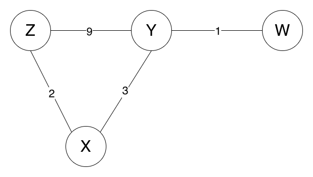
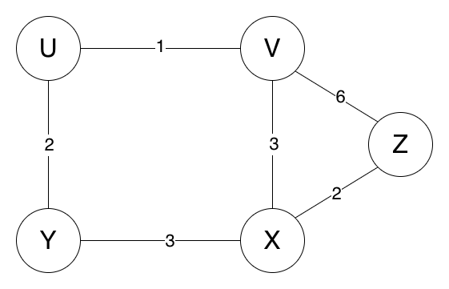
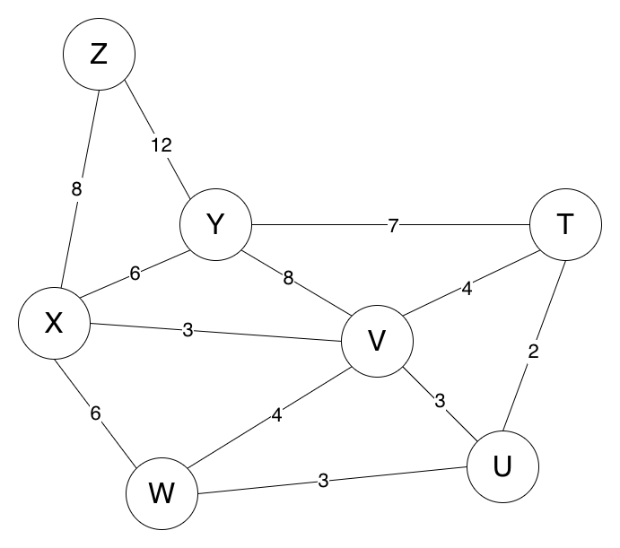

# Distance-Vector Routing

This assignment simulates routers exchanging distance vectors. Each router begins with its direct link costs, receives tables from its neighbors, and updates a route when it discovers a new destination or a lower total cost.

For a route advertised by neighbor `r`, the candidate cost is:

```text
cost to r + cost from r to the destination
```

## What I learned

- Representing network links and routing tables
- Sharing state between neighboring routers
- Applying the Bellman-Ford update rule
- Tracking both route cost and next hop
- Testing an algorithm with several network topologies

## Files

- [`src/router.py`](./src/router.py) contains the router and update logic.
- [`src/routing_utils.py`](./src/routing_utils.py) coordinates table exchanges and update rounds.
- `src/topology_*.py` defines four example networks. The first three include expected results in comments.
- [`main.py`](./main.py) runs all four examples.
- [`diagrams/`](./diagrams/) contains drawings of the first three networks.

## Topology diagrams





